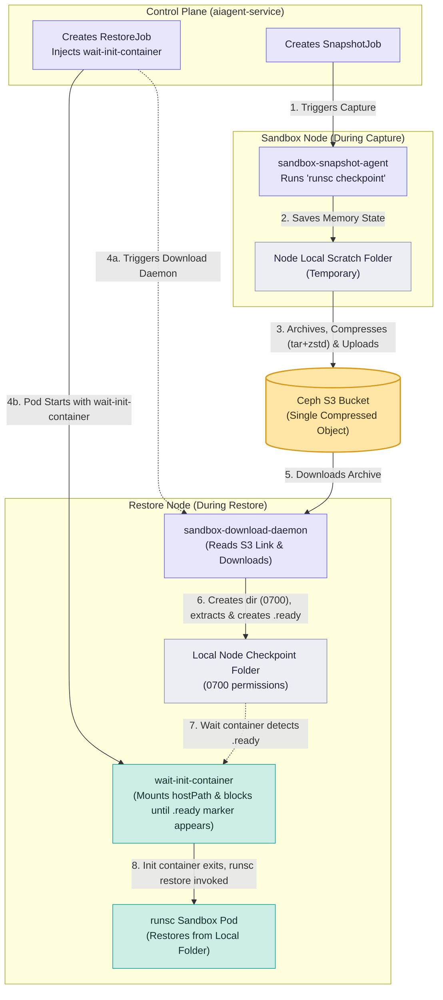
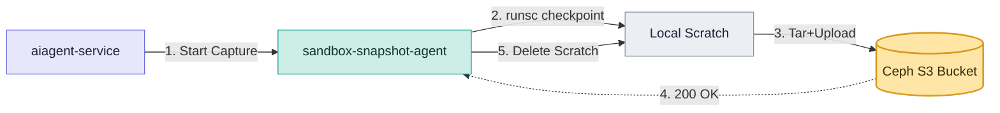
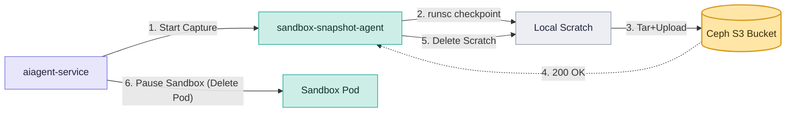
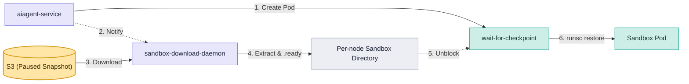
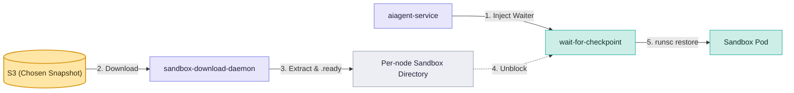

# Desigb docs : Sandbox Snapshots on Ceph Object Storage (S3)


## 1. Summary

Today, sandbox checkpoints are stored directly in CephFS, which is mounted on every data-plane node. This RFC changes the design. We will store each snapshot as a single compressed tar archive in Ceph S3 (Object Storage). 
- When taking a snapshot (**Capture**), the agent archives and compresses the files on the local node and uploads them to S3.
- When starting from a snapshot (**Restore**), a new background program on the node (the **Download Daemon**) securely downloads the compressed archive from S3, decompresses and extracts it, and lets the sandbox start. A wait init-container ensures the download is complete before runsc restore starts. This removes the need for a shared filesystem, keeps S3 credentials out of tenant pods, and allows Kubernetes to schedule pods normally without modifying runsc. The only trade-off is that restores are slower because the full checkpoint must be downloaded before restoration begins.

## 2. Goals

- **Move to Object Storage:** Store each snapshot as a single compressed object in Ceph S3 (RGW) instead of using CephFS.
- **Remove Shared Mounts:** Data-plane nodes will no longer need to mount a shared filesystem for snapshots.
- **Keep Scheduling Simple:** Restore pods should be scheduled normally by Kubernetes.
- **Improve Security:** Keep S3 credentials completely out of tenant pods. Only a trusted node daemon will have access to the credentials to perform downloads.
- **Don't Change the Runtime:** Ensure `runsc` (the sandbox runtime) can still restore from a local folder just like it does today, without needing any modifications.
- **Smooth Migration:** Allow the new S3 snapshots to work side-by-side with old CephFS snapshots during the transition, so we don't have to migrate all existing data at once.

## 3. Non-Goals

- We are not trying to make the restore speed instant right now. Downloading takes time, and we accept this for now.
- We will not use FUSE mounts (like `s3fs`) to pretend S3 is a local drive, because it is too slow for the sandbox engine.
- Backing up snapshots to different regions is out of scope for now.

## 4. Future Goals

- **Node-Local Caching:** Implement a node-local NVMe/SSD cache to speed up restores and forks. When a checkpoint is downloaded from S3, we will cache those files locally on the worker node. We will maintain a record of which nodes have cached which checkpoint files. During a restore, we will use a soft `nodeAffinity` to prefer scheduling the pod on the exact node where its checkpoint is already cached, allowing for a very fast restore. If that specific node is busy, Kubernetes will schedule the pod on another available node, which will just perform a normal restore by downloading the checkpoint from S3.

## 5. High-Level Design




### Components and Responsibilities

| Component | Status | Responsibility |
|---|---|---|
| Control Plane (`aiagent-service`) | Existing — Extended | **Currently it** creates snapshot/restore jobs.<br>**Now we extend it to** inject the `wait-init-container` and pass the S3 snapshot reference to the jobs. The scheduler handles pod placement without pinning. |
| Capture Agent (`sandbox-snapshot-agent`) | Existing — Extended | **Currently it** takes the `runsc checkpoint`.<br>**Now we extend it to** use the S3 object-store backend. It writes to node-local scratch, archives and compresses it (tar+zstd), uploads it to S3, and clears the scratch directory. |
| Download Daemon (`sandbox-download-daemon`) | **New** | A node DaemonSet and the *only* component holding the S3 read credential. Downloads and extracts the snapshot into a per-sandbox local directory when a restore pod lands on its node, creates a `.ready` marker, and removes the directory on pod teardown. |
| Wait Init-Container (`wait-for-checkpoint`) | **New** | Injected into each restore pod. It is credential-free and read-only. Blocks until the download daemon's `.ready` marker appears, then exits to let the sandbox start. |
| Ceph RGW (S3 Bucket) | New Usage | Stores each snapshot as a single compressed, tenant-scoped object (the durable artifact) rather than relying on a shared CephFS mount. |
| `runsc` (gVisor) & `kubelet` | Unchanged | Checkpoints and restores from a local host path. Requires no patches or wrappers. |

## 6. Component Implementation Details

### 6.1 `sandbox-download-daemon` (The Download Daemon)
- **Overview:** A new background application (DaemonSet) that runs on every data-plane node.
- **Implementation Approach:** This `sandbox-download-daemon` is implemented using Go code. We will keep this code in the `operators/sandbox-download-daemon/` path. This Go code contains the complete, automated logic to authenticate with S3, download the archive, decompress it, extract the files, and create the `.ready` marker. For security, we will **never** hardcode the S3 passwords in the code. Instead, Kubernetes will mount a secure Secret as Environment Variables, and the Go code will read these credentials dynamically at runtime (e.g., using `os.Getenv("S3_ACCESS_KEY")`).
- **Kubernetes Deployment Blueprint (YAML Specs):** This YAML file is the strict instruction manual for Kubernetes. It is absolutely required to run the Go code and guarantees three critical things:
  1. **Deployment (`kind: DaemonSet`):** Forces exactly one copy of the Go code to run automatically on every single worker node.
  2. **Storage Access (`hostPath`):** Grants the Go code permission to save extracted files directly to the physical node's hard drive (`/var/lib/snap-s3`), so the Sandbox can read them later.
  3. **Security (`secretKeyRef`):** Safely injects the encrypted S3 passwords directly into the Go code's memory as Environment Variables, avoiding hardcoded secrets.
  
  The skeletal implementation is as follows:
  ```yaml
  apiVersion: apps/v1
  kind: DaemonSet
  metadata:
    name: sandbox-download-daemon
    namespace: neevai-system
  spec:
    selector:
      matchLabels:
        app: sandbox-download-daemon
    template:
      metadata:
        labels:
          app: sandbox-download-daemon
      spec:
        containers:
        - name: daemon
          image: neevai/sandbox-download-daemon:latest
          volumeMounts:
          - name: host-checkpoint-dir
            mountPath: /var/lib/snap-s3
          env:
          - name: S3_CREDENTIALS
            valueFrom:
              secretKeyRef:
                name: s3-read-creds
                key: credentials
        volumes:
        - name: host-checkpoint-dir
          hostPath:
            path: /var/lib/snap-s3
            type: DirectoryOrCreate
  ```
- **Behavior:** It watches for new Restore Pods being placed on its node. When it sees one, it uses its secure S3 credentials to download the correct compressed snapshot archive from S3, extracts it into a secure local folder on the node, creates a `.ready` file, and later deletes the folder when the pod is deleted.

### 6.2 `wait-init-container` (The Wait Init-Container)
- **Overview:** A very small, simple container added to the start sequence of the sandbox.
- **Implementation Approach:** During a Restore or Resume flow, the Control Plane (`aiagent-service`) will automatically inject this `initContainer` into the Sandbox Pod YAML. It will have NO S3 credentials and NO network access.
- **Kubernetes Deployment Blueprint (YAML Specs):** This is the exact shape of the full Restore Pod after the Control Plane injects the `initContainer` and the `hostPath` annotations.
  ```yaml
  apiVersion: v1
  kind: Pod
  metadata:
    annotations:
      <checkpoint-host-path>: /var/lib/snap-s3/<ns>/<job>    # runtime restores the agent from here (host path)
  spec:
    runtimeClassName: gvisor
    volumes:
      - name: ready                                          # read-only view for the waiter only
        hostPath: { path: /var/lib/snap-s3/<ns>/<job> }
    initContainers:
      - name: wait-for-checkpoint                            # injected by the control plane; no credentials
        # block until the daemon's ready marker exists
        volumeMounts: [{ name: ready, mountPath: /ck, readOnly: true }]
    containers:
      - name: agent                                          # restored by runsc from the host-path annotation
      - name: sandboxd                                       # sidecar, part of the restored sandbox
  # the download daemon (node DaemonSet, not shown) holds the S3 credential and
  # populates /var/lib/snap-s3/<ns>/<job> out-of-band
  ```
- **Behavior:** It mounts the local folder as read-only. It runs a simple bash loop (`while [ ! -f /ck/.ready ]; do sleep 1; done`) to block the pod from starting. It waits patiently until the `sandbox-download-daemon` finishes downloading and extracting the files. Once the `.ready` file appears, this container immediately exits successfully, allowing the main sandbox to boot up safely.

### 6.3 `sandbox-snapshot-agent` (The Capture Agent - Update)
- **Overview:** The existing daemon on the node that talks to `runsc` to save the sandbox memory.
- **Implementation Approach:** We will update its Go code to add S3 upload capabilities. We will give it S3 write credentials.
- **Behavior:** Instead of writing to CephFS, it will tell `runsc` to write to a temporary local folder. Then, it will use `tar` and `zstd` to archive and compress the folder, upload the compressed object to S3, and finally delete the temporary folder.

### 6.4 `aiagent-service` (The Control Plane - Update)
- **Overview:** The central brain managing sandboxes.
- **Implementation Approach:** Update the Go code that builds the Pod definitions.
- **Behavior:** When creating a restore pod, it will inject the `wait-for-checkpoint` init-container and set the correct local `hostPath` so `runsc` knows where to look for the downloaded files.


## 7. Operational Workflows

### 7.1 Snapshot Capture Workflow


### 7.2 Pausing Workflow


### 7.3 Resume Workflow


### 7.4 Restore / Fork from Snapshot Workflow


### 7.5 Live Forking Workflow

```mermaid
flowchart LR
    CP["aiagent-service"]:::cp -->|"1. Start Capture"| SA["sandbox-snapshot-agent"]:::dp
    SA -->|"2. runsc checkpoint"| SC["Local Scratch"]:::store
    SC -->|"3. Tar+Upload"| S3[("S3 (Recently Taken Snapshot)")]:::star
    S3 -.->|"4. 200 OK"| CP
    CP -->|"5. Create NEW Pod"| WAIT["wait-for-checkpoint"]:::dp
    S3 -->|"6. Download"| DD["sandbox-download-daemon"]:::cp
    DD -->|"7. Extract to NEW folder"| LD["Per-node Sandbox Directory"]:::store
    LD -.->|"8. Unblock"| WAIT
    WAIT -->|"9. runsc restore"| RUN["New Sandbox Pod"]:::dp

    classDef cp fill:#e7e6fb,stroke:#6b6be0,color:#20233a
    classDef dp fill:#cdeee7,stroke:#12a594,color:#10302b
    classDef store fill:#eceef3,stroke:#8a93a6,color:#20233a
    classDef star fill:#ffe6a7,stroke:#d99a1c,stroke-width:2px,color:#3a2c07
```


### 7.6 How Local Storage is Cleaned Up After Deletion
- Checkpoint files take up space on the node's local hard drive.
- When a sandbox is stopped or fully deleted by the user, Kubernetes removes the pod from the node.
- The `sandbox-download-daemon` is constantly watching the node. When it detects that a pod has been deleted, it automatically deletes the local folder (e.g., `rm -rf /var/lib/snap-s3/<namespace>/<job>`).
- This guarantees that no snapshot data is left behind on the node taking up space.

### 7.7 How We Will Do a Smooth Migration
- We will support **both** the old CephFS way and the new S3 way at the same time.
- In the database, every snapshot record will have a link (e.g., `cephfs://path/to/snapshot` or `s3://bucket/snapshot.tar.zst`).
- When restoring, the `aiagent-service` will check the link format.
  - If it starts with `cephfs://`, it will build the Pod the old way (mounting the shared folder).
  - If it starts with `s3://`, it will build the Pod the new way (injecting the `wait-for-checkpoint` container and relying on the download daemon).
- All *new* snapshots will be created as `s3://`. 
- We do not need to convert old snapshots. They will stay on CephFS and continue to work until they naturally expire or are deleted by the user.

---

## 8. Security Considerations
- **No S3 Credentials in User Pods:** The `wait-for-checkpoint` init-container and the `runsc` sandbox NEVER have access to S3 credentials. All S3 downloads are strictly handled by the trusted `sandbox-download-daemon`.
- **Directory Permissions:** The local scratch directory created by the daemon (e.g. `/var/lib/snap-s3/<ns>/<job>`) is created with strict **`0700`** permissions. Only the daemon and the root node components can access the raw checkpoint files.
- **Secure Archive Extraction:** The daemon will enforce strict checks during tar extraction to ensure no files are extracted outside of the designated sandbox directory (preventing Zip Slip/tar traversal attacks).

## 9. Risks and Mitigations
- **Node Disk Space Exhaustion:** 
  - *Risk:* If multiple large sandboxes are saved/restored on the same node, the local disk could fill up.
  - *Mitigation:* The `sandbox-snapshot-agent` deletes scratch files immediately upon successful S3 upload. The `sandbox-download-daemon` actively watches Kubernetes pod deletion events and runs immediate cleanup (`rm -rf`) on the local folder when a sandbox terminates.
- **Download Daemon Failure:**
  - *Risk:* The `sandbox-download-daemon` crashes while downloading a snapshot.
  - *Mitigation:* It is deployed as a Kubernetes `DaemonSet`. Kubelet will automatically restart it. The daemon will wipe partial downloads and resume/restart the S3 download cleanly upon reboot.
- **Large Snapshot Latency:**
  - *Risk:* 10GB+ memory footprints may take a long time to download over the network, delaying sandbox boot.
  - *Mitigation:* We use `zstd` compression to heavily compress the archive before upload. 

**10. Open questions (need a human decision)**

1. **Caching & Scheduling:** Should we cache downloaded snapshots on the node's local disk and use soft `nodeAffinity` to prefer those nodes during future restores? *(This prevents redundant S3 downloads, but requires managing node disk space).*
2. **Streaming Restore:** Should we let the sandbox start immediately and load memory pages over the network as it runs, instead of waiting for the full download to finish? *(This is faster, but very risky if the network drops).*
3. **Capture Scratch Location:** When taking a new checkpoint, should the temporary scratch space be the raw local disk (fastest, but lost if the node crashes) or a persistent volume (slower, but crash-durable)?
4. **Compression Choice:** How hard should we compress the snapshot before uploading? *(We need to balance the CPU cost of compression against the savings in object size, especially since memory data often doesn't compress well).*
5. **Object Durability Tier:** Do we need to back up these snapshots to different geographical regions, or is a single-region S3 bucket enough?
6. **Waiter Readiness Signal:** How should the Restore Pod know when the download is finished? Should it look for a hidden `.ready` file on the hard drive *(requires a `hostPath` mount)*, or should it ask the Kubernetes API *(requires giving the pod API credentials)*?
