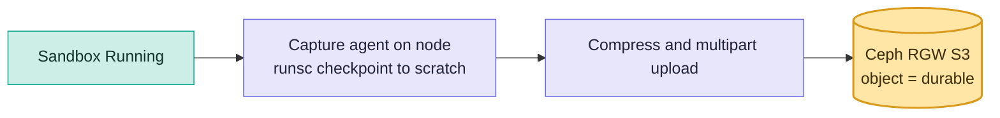
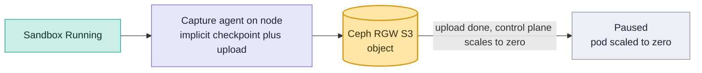
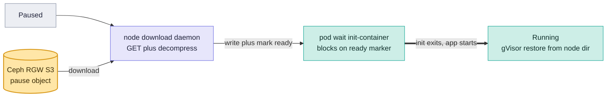
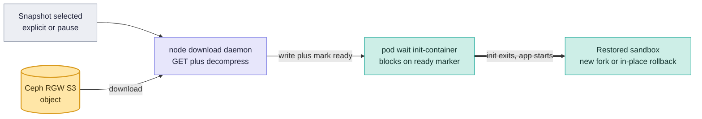

# RFC: Sandbox Snapshots on Ceph Object Storage (S3/RGW)

| | |
|---|---|
| Status | Draft |
| Scope | sandbox-sr-operator (DP) and aiagent-service (CP): replace the CephFS snapshot store with per-snapshot objects in Ceph's S3 gateway — capture uploads, a node daemon downloads on restore |
| Related | [`rfc_sandbox_checkpoint_restore.md`](rfc_sandbox_checkpoint_restore.md), [`rfc_sandbox_memory_snapshots.md`](rfc_sandbox_memory_snapshots.md) |

## Summary

Today, sandbox checkpoints are stored directly in CephFS, which is mounted on every data-plane node. This RFC replaces CephFS with Ceph S3 (RGW), where each snapshot is stored as a single compressed object. During capture, the checkpoint is temporarily written to the local node, compressed, and uploaded to S3. During restore, a trusted download daemon fetches the snapshot from S3 into a local directory, and a wait init-container ensures the download is complete before runsc restore starts. This removes the need for a shared filesystem, keeps S3 credentials out of tenant pods, and allows Kubernetes to schedule pods normally without modifying runsc. The only trade-off is that restores are slower because the full checkpoint must be downloaded before restoration begins.

## Problem

Today, sandbox snapshots are stored in **CephFS**, which is mounted in **read-write mode on every data-plane node**. When a snapshot is created, the checkpoint is written directly to CephFS. During restore, `runsc` reads the checkpoint directly from the same location. This works because every node has access to the shared CephFS filesystem. 

However, using a shared filesystem creates several challenges:

| **Problem**                                              | **Why it is a problem**                                                                                                                                     |
| -------------------------------------------------------- | ----------------------------------------------------------------------------------------------------------------------------------------------------------- |
| **Single shared filesystem for all snapshot operations** | Every snapshot read and write goes through the same CephFS metadata service, which can become a bottleneck and affects all nodes if it slows down or fails. |
| **CephFS is mounted on every data-plane node**           | Every node must maintain a read-write mount, increasing operational complexity, security exposure, and making the shared storage harder to scale.           |
| **No per-snapshot isolation**                            | All snapshots are stored in one shared location, making it difficult to manage quotas, lifecycle policies, and usage for individual snapshots.              |

An object store solves these problems by storing **each snapshot as a separate object** in S3. Any node can download only the snapshot it needs over HTTP, without mounting a shared filesystem. This provides better isolation and simpler storage management. The trade-off is that the entire snapshot must be downloaded before a restore can begin, which increases restore time for larger snapshots.

## Goals

- **Move to Object Storage:** Store each snapshot as a single compressed object in Ceph S3 (RGW) instead of using CephFS.
- **Remove Shared Mounts:** Data-plane nodes will no longer need to mount a shared filesystem for snapshots.
- **Keep Scheduling Simple:** Restore pods should be scheduled normally by Kubernetes.
- **Improve Security:** Keep S3 credentials completely out of tenant pods. Only a trusted node daemon will have access to the credentials to perform downloads.
- **Don't Change the Runtime:** Ensure `runsc` (the sandbox runtime) can still restore from a local folder just like it does today, without needing any modifications.
- **Smooth Migration:** Allow the new S3 snapshots to work side-by-side with old CephFS snapshots during the transition, so we don't have to migrate all existing data at once.

## Non-goals

- Not optimising for minimum restore latency. Lazy-paged block restore (RBD) is the
  documented fast-path alternative if resume/fork latency becomes the constraint.
- No FUSE-mounting the bucket to fake a filesystem (see Alternatives — object
  stores serve the checkpoint's random reads poorly).
- Cross-region replication of snapshots is possible with RGW multi-site but is out
  of scope for the first version.

## Proposal

### High-level design

```mermaid
flowchart LR
    subgraph CPsg["Control plane — aiagent-service"]
        CP["orchestrate checkpoint and pause<br/>inject wait init-container, pass object reference"]:::cp
    end

    subgraph SNsg["Sandbox node — capture"]
        AG["capture agent<br/>runsc checkpoint"]:::cp
        SC["node-local scratch"]:::store
    end

    RGW[("Ceph RGW S3<br/>compressed object<br/>durable, shared, no mount")]:::star

    subgraph RNsg["Restore node — any, scheduler-picked"]
        DM["download daemon DaemonSet<br/>holds creds, GET plus decompress"]:::cp
        LD[("per-sandbox node dir<br/>0700 plus ready marker")]:::store
        POD["restore pod<br/>wait init-container blocks on marker<br/>then runsc restore reads node dir"]:::dp
    end

    CP -->|"1 SnapshotJob"| AG
    AG -->|"2 checkpoint"| SC
    SC -->|"3 compress plus upload"| RGW
    CP -.->|"object reference"| DM
    RGW -->|"4 download"| DM
    DM -->|"5 write plus mark ready"| LD
    LD -->|"6 marker gates start, then restore"| POD
    CP -->|"GC delete object"| RGW

    classDef cp fill:#e7e6fb,stroke:#6b6be0,color:#20233a
    classDef dp fill:#cdeee7,stroke:#12a594,color:#10302b
    classDef store fill:#eceef3,stroke:#8a93a6,color:#20233a
    classDef star fill:#ffe6a7,stroke:#d99a1c,stroke-width:2px,color:#3a2c07

    style CPsg fill:#f3f1ff,stroke:#6b6be0
    style SNsg fill:#ecfaf6,stroke:#12a594
    style RNsg fill:#ecfaf6,stroke:#12a594
```



The Ceph RGW bucket is the durable centre and the *only* thing shared between
nodes — reached over HTTP, never mounted. **Capture** (steps 1–3) runs on the
sandbox's own node: checkpoint to node-local scratch, then compress and upload one
object. **Restore** (steps 4–6) runs on whatever node the scheduler picked: a
trusted node **download daemon** pulls the object (using its own scoped S3
credential) into a per-sandbox node directory and marks it ready; a credential-free **wait
init-container** in the pod blocks until the marker appears, then `runsc restore`
reads the directory. The tenant pod holds no credentials and does the download
nowhere — the daemon does it out-of-band. The runtime is unmodified; its checkpoint
path is just a node-local directory now instead of a shared CephFS one.

### Why download, not mount

With the current CephFS design, `runsc checkpoint` writes checkpoint files directly to a shared CephFS directory. Since every data-plane node mounts the same filesystem, `runsc restore` can read those files directly without any additional copy or download.

In the proposed design, snapshots are stored as compressed objects in Ceph RGW (S3). Since S3 is an object store rather than a filesystem, `runsc` cannot restore directly from it. The snapshot must first be downloaded, decompressed, and extracted into a local checkpoint directory before `runsc restore` can use it.

There are two ways to make the checkpoint available locally:

- **Download to local disk (chosen).** A trusted node-local download daemon downloads and extracts the snapshot into a per-sandbox checkpoint directory, creates a `.ready` marker, and the wait init-container allows `runsc restore` to start only after the checkpoint is ready. This approach is simple, reliable, and keeps S3 credentials out of sandbox pods.
- **FUSE-mount the S3 bucket (rejected).** Tools such as s3fs or mountpoint-for-s3 can expose an S3 bucket as a local filesystem. However, every random read performed by `runsc restore` would be translated into HTTP range requests to S3, introducing significant network latency and making restore performance unsuitable for checkpoint workloads.

### Components and responsibilities

| Component | Status | Responsibility |
|---|---|---|
| Control plane (aiagent-service) | Existing — extended | Creates snapshot/restore jobs, injects the wait init-container, and passes the snapshot reference to the download daemon . No node selection — the scheduler places the pod. |
| Capture agent — node DaemonSet | Existing — gains the object-store backend | On the sandbox's own node: takes the snapshot (runsc checkpoint into a transient scratch dir) and uploads it as one compressed object, then clears the scratch. |
| Download daemon — node DaemonSet | **New** | The only component holding the S3 read credential. When a restore pod lands on its node it downloads and decompresses the object into a per-sandbox node directory, writes a ready marker, and removes the directory on teardown. |
| Wait init-container | **New** | Injected into each restore pod: credential-free and read-only, it blocks until the daemon's ready marker appears, then exits so the app container starts. |
| Ceph RGW (S3) bucket | New usage | Stores each snapshot as one compressed, tenant-scoped object — the durable artifact. |
| runsc / gVisor, kubelet | Unchanged | Checkpoints, and restores from a host path. Not patched or wrapped. |

The new pieces are the **download daemon** (a trusted node DaemonSet) and a
credential-free **wait init-container**. There is no block-device attach, no
per-restore volume, no node-pinning controller, and no staging record — placement
stays scheduler-native, and nothing sensitive lives in the tenant pod.

### Capture

The capture agent runs on the sandbox's own node (it must, to reach the runtime):

| Step | Action |
|---|---|
| Checkpoint | `runsc checkpoint --leave-running` into a transient scratch directory on the node (node-local disk, or a node-scoped scratch volume for crash-durability) |
| Upload | compress the checkpoint (tar + zstd) and multipart-upload it as one object, keyed by tenant and job; record the object reference |
| Cleanup | delete the local scratch once the upload completes |
| Failure | on any error, delete the scratch and the partial object, then retry |

The checkpoint uses leave-running, so the compress-and-upload work is never sandbox
downtime — it only affects how soon the snapshot reaches Ready.

### Restore (and fork, rollback, resume)

Restore is a download done by a trusted node daemon, and it needs no special
placement:

| Step | Action |
|---|---|
| Schedule | the pod is created and scheduled **normally** — any node, full scheduler fit/taints/spread, no pinning |
| Download | the node's download daemon `GET`s the object with its own scoped S3 credential, decompresses it into a per-sandbox node directory, and writes a ready marker |
| Gate | a credential-free wait init-container in the pod blocks until the ready marker appears, then exits |
| Restore | the app container starts and `runsc restore` reads the checkpoint from the node directory (host path) |
| Teardown | the daemon removes the node directory when the pod is gone |

Ordering is solved by construction: the wait init-container completes only once the
daemon has marked the directory ready, and an init-container always completes before
the app container starts, so the checkpoint is present before `runsc restore` runs —
no stage record, scheduling gate, or node-pinning. A probe cannot do this job:
gVisor restores at container *create*, which is before any startup/readiness probe
runs. Fork, rollback, and resume are the same flow; resume targets the same sandbox,
fork a new one. Each fork downloads its own copy unless a per-node cache is added
(see open questions).

### Restore pod anatomy

The download is done by the trusted node **download daemon**, not inside the pod, so
the pod carries no credentials. The restore pod adds only two things over a normal
sandbox pod: a credential-free **wait init-container** and the checkpoint host-path
annotation.

```mermaid
flowchart LR
    CP["Control plane<br/>injects wait init-container,<br/>passes object reference"]:::cp
    RGW[("Ceph RGW S3<br/>snapshot object")]:::star
    DM["download daemon DaemonSet<br/>holds creds, GET plus decompress"]:::cp
    ND[("per-sandbox node dir<br/>0700 plus ready marker")]:::store

    subgraph POD["Restore pod — runtimeClass gVisor, any node"]
        direction TB
        WAIT["wait init-container<br/>credential-free, blocks on marker"]:::dp
        AGENT["agent container<br/>restored by runsc from node dir"]:::dp
        SD["sandboxd sidecar<br/>part of the restored sandbox"]:::dp
    end

    CP -.->|"object reference"| DM
    RGW -->|"1 download object"| DM
    DM -->|"2 write checkpoint plus ready marker"| ND
    ND -->|"3 marker seen"| WAIT
    WAIT ==>|"init exits, then app starts"| AGENT
    ND -->|"4 runsc restore reads (host path)"| AGENT
    AGENT --- SD

    classDef cp fill:#e7e6fb,stroke:#6b6be0,color:#20233a
    classDef dp fill:#cdeee7,stroke:#12a594,color:#10302b
    classDef store fill:#eceef3,stroke:#8a93a6,color:#20233a
    classDef star fill:#ffe6a7,stroke:#d99a1c,stroke-width:2px,color:#3a2c07
    style POD fill:#ecfaf6,stroke:#12a594
```



- The **download daemon** is a trusted node DaemonSet — the only component with the
  S3 credential. Triggered when a restore pod lands on its node, it downloads and
  decompresses the object into a per-sandbox node directory (mode `0700`) and writes
  a ready marker. The tenant pod never holds a credential and never runs the
  download.
- The **wait init-container** is injected by the control plane, credential-free, and
  read-only. It blocks until the ready marker appears, then exits so the app
  container starts. It observes the marker through a read-only view of the node
  directory — its entire footprint.
- The **agent container** and the **sandboxd sidecar** are part of the captured
  sandbox and restored together; `runsc` reads the checkpoint from the node
  directory (host path) out-of-band — the agent container mounts nothing.
- **Ordering is free**: the wait init-container finishes (marker present) before the
  app container starts. A probe cannot substitute — gVisor restores at container
  create, before probes run.

Illustrative shape (fields that differ from a fresh sandbox pod):

```yaml
apiVersion: v1
kind: Pod
metadata:
  annotations:
    <checkpoint-host-path>: /var/lib/snap-s3/<ns>/<job>    # runtime restores the agent from here (host path)
spec:
  runtimeClassName: gvisor
  volumes:
    - name: ready                                          # read-only view for the waiter only
      hostPath: { path: /var/lib/snap-s3/<ns>/<job> }
  initContainers:
    - name: wait-for-checkpoint                            # injected by the control plane; no credentials
      # block until the daemon's ready marker exists
      volumeMounts: [{ name: ready, mountPath: /ck, readOnly: true }]
  containers:
    - name: agent                                          # restored by runsc from the host-path annotation
    - name: sandboxd                                       # sidecar, part of the restored sandbox
# the download daemon (node DaemonSet, not shown) holds the S3 credential and
# populates /var/lib/snap-s3/<ns>/<job> out-of-band
```

### Security of the checkpoint directory

The checkpoint must temporarily exist on the node's local filesystem because runsc restore can only restore from a local host path. It cannot restore directly from S3. During restore, the download daemon—a trusted node DaemonSet—downloads the snapshot from S3, extracts it into a per-sandbox checkpoint directory, and creates the .ready marker. The restore pod never accesses S3 directly and never receives S3 credentials. Its only addition is a credential-free, read-only wait init-container, which waits for the .ready marker before allowing the application container to start.

The design contains the risk rather than accepting it:

| Risk | Mitigation |
|---|---|
| S3 credential exposed to tenant workloads | The credential lives only in the node download daemon (a platform DaemonSet the sandbox cannot reach), read-scoped to the snapshot bucket; no tenant pod carries it |
| Tenant-controlled path could target `/`, kubelet dirs, or the runtime socket | The pod spec, volume, and host path are **server-generated by the control plane**; tenant-supplied fields (image, command, env) cannot add a volume or change the path |
| Cross-tenant leakage of a checkpoint (full guest memory — secrets in RAM) | A unique **per-sandbox directory**, mode `0700` owned by a dedicated uid, written only by the daemon; the waiter mounts exactly that subpath read-only, and it is deleted on teardown |
| A crafted object escaping extraction onto the host (path traversal) | The daemon (not the pod) does extraction and **rejects tar entries with `..` or absolute paths**; tenants cannot reach the daemon or its credential to substitute the object |
| Sensitive checkpoint content plaintext on host disk | Restrictive permissions, prompt teardown, and node-disk encryption as the at-rest backstop |

The key security principle is that all S3 access and checkpoint preparation happen in the trusted node download daemon, not inside the sandbox pod. The sandbox pod never downloads the checkpoint, never holds S3 credentials, and never writes to the checkpoint directory. It only waits for the checkpoint to become ready, after which runsc restores the sandbox from the local checkpoint directory. This keeps gVisor as the security boundary between the platform and tenant workloads

### Operation flows

Two primitives touch the store: **checkpoint** (capture uploads an object) and
**restore** (the daemon downloads it). Pause is an implicit checkpoint then
scale-to-zero; resume is a restore of the pause object.

Checkpoint:



Pause — implicit checkpoint, then free the compute:



Resume — the daemon downloads the pause object and the pod restores in place:



Restore, fork, or rollback — the daemon downloads a chosen object into a target
sandbox:



### Consistency, sizing, GC

| Concern                     | Approach                                                                                                                                                 |
| --------------------------- | ----------------------------------------------------------------------------------------------------------------------------------------------------------------- |
| **Write consistency**       | A restore can only see a fully uploaded snapshot. `.ready` is created only after download and extraction finish.                                                  |
| **Object size**             | Checkpoints are compressed before uploading to reduce storage, network transfer, and restore time.                                                                |
| **Node-local disk**         | Temporary checkpoint copies consume local disk during capture and restore, so sufficient node storage is required.                                                |
| **Garbage Collection (GC)** | The temporary node directory is deleted after restore, while the S3 snapshot remains until it is explicitly deleted or expires according to its retention policy. |

### Access and Rollout

- **Snapshot Storage:** Each sandbox snapshot is stored as a separate object (or object prefix) in Ceph RGW and accessed over HTTP, eliminating the need for a shared filesystem or block-device attachment.
- **Credential Management:** The download daemon is the only component that holds the S3 read credential and uses it to download snapshots during restore. The capture agent is the only component that holds the S3 write credential and uploads snapshots during capture. The control plane only passes the snapshot object reference, while sandbox pods never receive S3 credentials.
- **Platform Isolation:** Both the capture agent and download daemon are trusted platform components running on the node. Tenant workloads cannot access these components or their credentials.
- **Gradual Rollout:** The platform supports both CephFS and S3 snapshot backends during the migration. Existing CephFS snapshots continue to restore normally, while new snapshots are stored in S3. This allows a gradual rollout without requiring migration of existing snapshots.

## Alternatives considered

| Alternative | Why not (for this RFC) |
|---|---|
| **Keep CephFS** | The status quo. Simple ops and free cross-node visibility, but the metadata-server bottleneck, shared read-write mount blast radius, and absent per-snapshot isolation are what we want to escape. |
| **In-pod downloader init-container** | Have the init-container itself download the object rather than a node daemon. Simpler — one fewer component — but it puts an S3 credential (or a pre-signed URL to work around that) and a read-write host mount inside every restore pod, which the tenant shares. The node-daemon split keeps the credential and the download out of tenant pods entirely — the daemon is a platform component the sandbox cannot reach — leaving only a credential-free read-only waiter, so it is preferred. |
| **RBD block, read-only snapshot map** | Each snapshot is an RBD image with a protected read-only snapshot; restore maps it read-only and gVisor lazily pages memory over the network, so a big-memory sandbox can be running before most of its memory transfers, and forks share blocks. Strictly faster restore than download. Rejected here because it is single-attach: restore must map the volume on a specific node before the container starts, forcing control-plane node selection plus a durable stage record and a scheduling-gate handshake. **This is the fast-restore fallback if download latency becomes the constraint.** |
| **Download-then-pin (no waiter)** | A node daemon downloads and the control plane creates the pod pinned to that node only once ready — zero in-pod footprint, but it reintroduces control-plane node selection and a readiness handshake (the RBD stage-then-pin shape). Rejected for the same complexity; the wait init-container keeps placement scheduler-native for the price of a tiny credential-free container. |
| **FUSE-mount the bucket** | Makes the object look like a mounted path, but restore's random reads of the memory-pages file map to small random range-GETs at tens-of-milliseconds each, so paging is pathologically slow. Unsuitable for checkpoint I/O. |

## Risks, trade-offs, open questions

**Risks / trade-offs**

- **Restore latency scales with the checkpoint (memory) size.** The daemon pulls the
  entire object before the app container starts, and there is no lazy paging — a
  large-memory resume or fork is a large transfer up front. This is the central
  trade of the object-store approach. The main future mitigation is **cache-affinity
  scheduling**: bias placement toward a node whose daemon already holds the
  checkpoint (the capture node, or one that downloaded it earlier), turning a cache
  hit into a near-zero-download restore. Placement here is only a *soft preference* —
  a cache miss falls back to downloading elsewhere — so it adds locality without the
  mandatory node-pinning the single-attach RBD design required.
- **Fork amplification.** Each fork of the same snapshot downloads its own copy
  unless a per-node cache is added.
- **Node-local disk pressure.** Both the capture scratch and the downloaded
  checkpoint consume node-local disk; many concurrent large checkpoints can exhaust
  it.
- **Two full data movements per lifecycle.** Upload on capture and download on
  restore, versus a mount that transfers only what is read. Plus compression and
  decompression CPU on each side.

**Open questions (need a human decision)**

1. Should we cache downloaded checkpoints on each node and prefer scheduling restores on nodes where the checkpoint is already available, or should every restore download a fresh copy from S3?
2. **Streaming restore.** Overlap download with restore — let gVisor async-load
   memory pages from the object as it streams in, rather than fully downloading
   first? It could cut latency toward the RBD model, but is fragile (the download
   must stay ahead of the loader) and needs runtime cooperation.
3. **Capture scratch location.** Node-local disk (fastest, lost on node crash before
   upload) or a node-scoped scratch volume (crash-durable staging, slower writes)?
4. **Compression choice.** zstd level / dictionary trade-off between capture CPU,
   object size, and restore decompress time — and does it pay for memory-heavy
   checkpoints that compress poorly?
5. **Object durability tier.** Single-region bucket now; if cross-region snapshot
   availability is needed, RGW multi-site versus an explicit copy step.
6. **Waiter readiness signal.** The wait init-container observes the daemon's ready
   marker through a read-only view of the per-sandbox node directory (a read-only
   `hostPath`, credential-free). Is that acceptable, or should the signal come
   through the API (a pod condition the daemon sets) to avoid any `hostPath` in the
   pod — at the cost of giving the waiter API access? The download daemon coupling to
   pod scheduling (how it learns which object to fetch for a pod on its node) is
   settled the same way either path — a per-restore annotation or record the daemon
   watches.

## Appendix

### A. Storage-backend contract

A snapshot-storage backend owns four things: where a checkpoint is written,
finalising it into a durable reference, deleting it idempotently, and the reference
scheme it owns. The CephFS backend writes straight to the final path and finalises
by doing nothing. The object-store backend writes to node-local scratch, and
finalises by compressing and uploading the object (then clearing scratch); its
reference is the object key. Restore is handled by the node download daemon and the
wait init-container, not the backend.

### B. Storage reference and restore contract

- Reference form: `s3://<bucket>/<org>/<project>/<sandbox>/snapshot-<job>.tar.zst`,
  recorded alongside the snapshot record exactly as the CephFS reference is today.
- The restore plan injects a credential-free wait init-container and sets the
  checkpoint host-path annotation to the per-sandbox node directory the download
  daemon populates. The pod is scheduled normally — no node affinity or pinning.

### C. Command flow

```
CAPTURE (sandbox node — capture agent)
  runsc checkpoint --leave-running --image-path=<scratch>
  tar -C <scratch> . | zstd | s3 multipart put  s3://<bucket>/<key>
  rm -rf <scratch>

RESTORE
  # node download daemon (holds the scoped credential), when a restore pod lands:
  s3 get s3://<bucket>/<key> | zstd -d | tar -x -C /var/lib/snap-s3/<ns>/<job>
  touch /var/lib/snap-s3/<ns>/<job>/.ready
  # pod wait init-container (credential-free, read-only): blocks until .ready exists
  # app container (runsc shim):
  runsc restore --image-path=/var/lib/snap-s3/<ns>/<job>
  # teardown: daemon removes the node directory when the pod is gone

DELETE
  s3 rm s3://<bucket>/<key>            # or bucket lifecycle / TTL
```

### D. Prior art

This is close to the object-store design the codebase used before the
CephFS-in-place refactor (an S3-compatible client to Ceph RGW, compressed blobs, and
a per-node scratch dir). The delta from that design is two-fold: coexistence with
the current CephFS backend via scheme dispatch, and moving the download out of an
in-pod init-container into a trusted node daemon so tenant pods hold no credentials.
